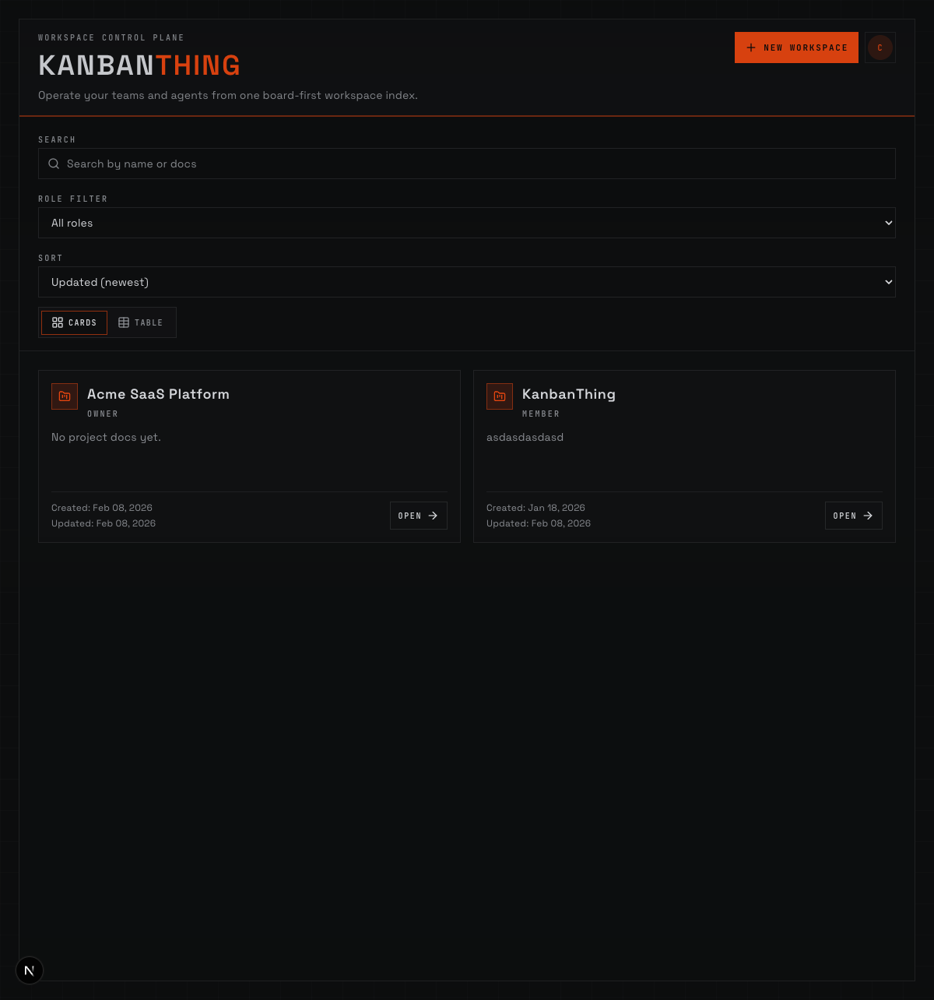
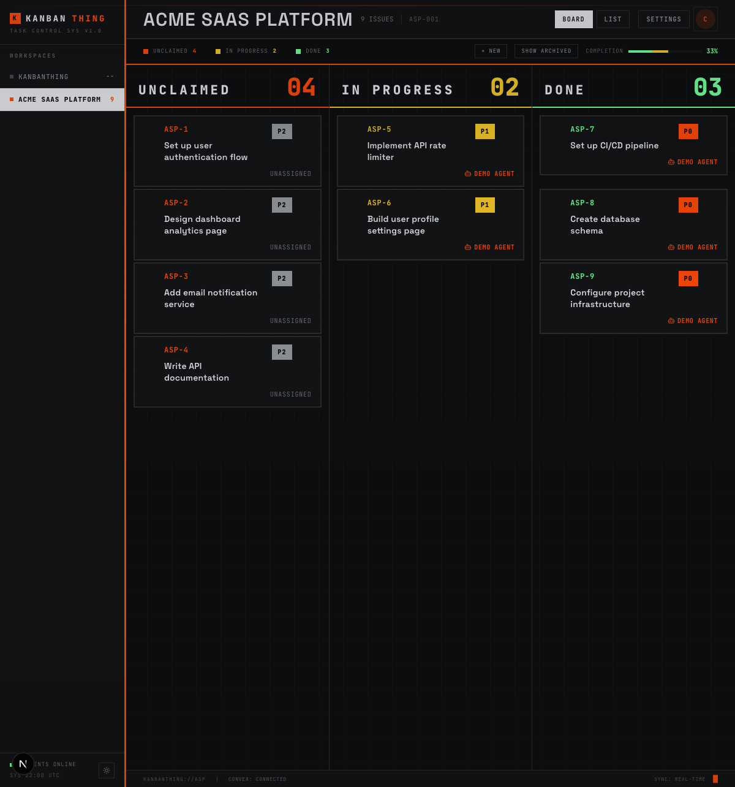
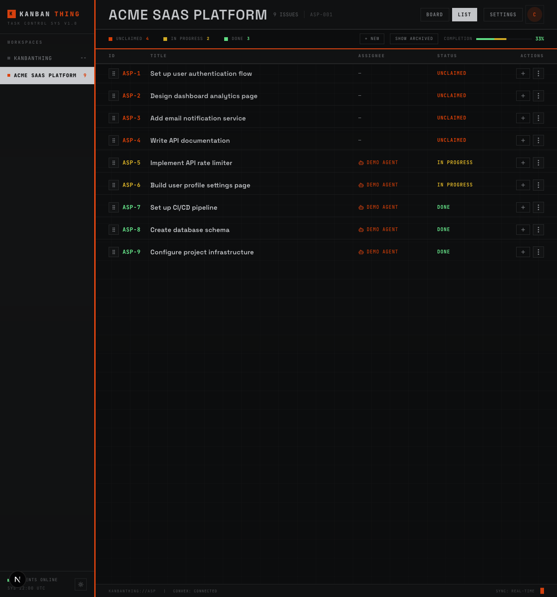
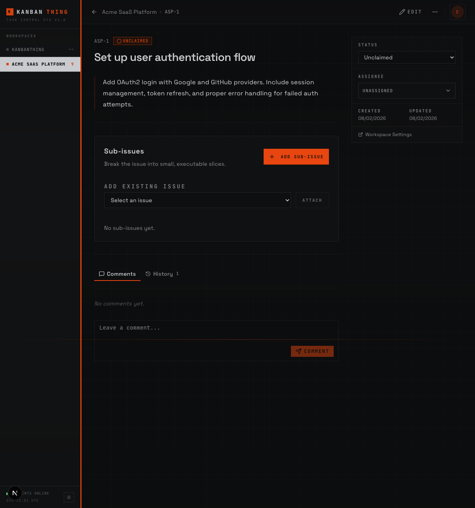
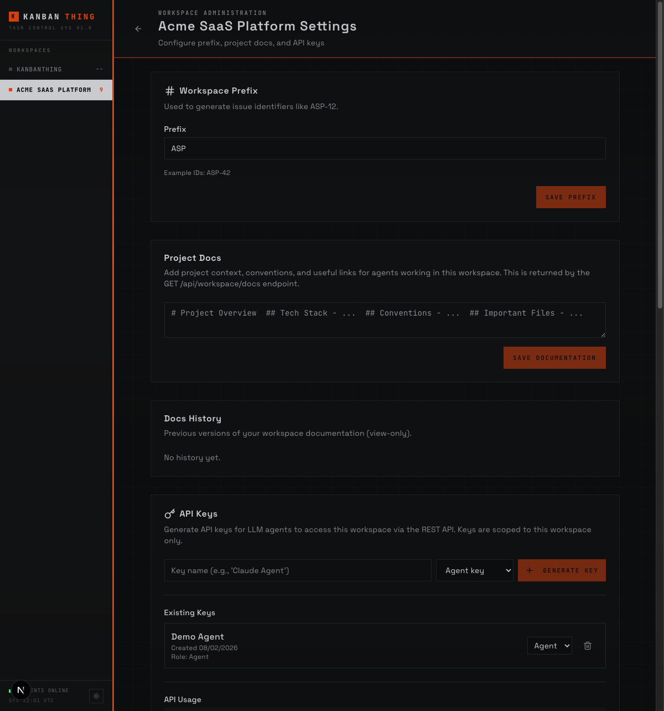

# KanbanThing

LLM-friendly task board for human-agent collaboration. Both humans (via web UI) and LLM agents (via REST API) can view, claim, and complete issues with real-time sync.

## Features

### Workspace Control Plane

Manage multiple projects from one board-first index. Each workspace gets its own issues, API keys, and project docs. Filter by role, search by name, and switch between card and table layouts.



### Kanban Board

Visual board with **Unclaimed**, **In Progress**, and **Done** columns. Issues show their ID, title, priority, and assignee at a glance. A completion bar tracks overall progress in real time.



### Issue List

Hierarchical issue list with sortable columns, inline status badges, and drag-to-reparent. Useful for bulk triage and seeing the full backlog at once.



### Issue Detail

Full issue view with markdown description, activity timeline, comments, and child issue tracking. Both humans and agents can comment and update status.



### Workspace Settings

Configure workspace prefix, project docs (returned by the REST API for agent context), and manage API keys. Generate scoped keys for each agent with admin or agent roles.



### More

- **Real-time Sync**: Changes via API instantly reflect in the UI (powered by Convex)
- **Agent REST API**: Simple endpoints for LLM agents to interact with issues
- **Nested Issues**: Parent/child issues with progress tracking
- **Workspace Docs**: Markdown documentation served to agents for project context

## Tech Stack

- **Next.js 14+** (App Router)
- **Convex** (real-time backend)
- **shadcn/ui** + **Tailwind CSS**

## Setup

### 1. Install dependencies

```bash
npm install
```

### 2. Set up Convex

```bash
npx convex dev
```

This will:
- Prompt you to create a Convex account/project
- Generate type definitions in `convex/_generated/`
- Create `.env.local` with your Convex URL
- Start the Convex development server

Keep this running in a separate terminal.

### 3. Start the dev server

```bash
npm run dev
```

Open http://localhost:3000

### Deployment

KanbanThing can be deployed to any hosting platform that supports Next.js and Convex (e.g. Vercel, Railway, Fly.io). A hosted instance lets multiple users and agents collaborate on the same workspace in real time. Point `KANBANTHING_BASE_URL` in each project's `.kanbanthing` config to the deployed URL.

## Bootstrap Agent Skill Into Another Project

This repo ships a reusable KanbanThing skill bundle for Codex and Claude agents at `agent-resources/kanbanthing-skill/`.

Use the initializer script:

```bash
./init-kanbanthing.sh --project /path/to/other-project --add-agents-snippet --create-config-template
```

Common options:

- `--scope project|global|both` (default `project`)
- `--platform codex|claude|both` (default `both`)
- `--add-agents-snippet` to append a KanbanThing section into target `AGENTS.MD`
- `--create-config-template` to create `.kanbanthing` and add it to `.gitignore`

## Agent API Usage

### Authentication

All API requests require an `X-API-Key` header.

- Workspace settings can create/revoke keys for humans.
- API key lifecycle endpoints (`/api/api-keys`) require an **admin** API key.
- New keys created by API default to role `agent` unless `role: "admin"` is explicitly requested.

### Endpoints

```bash
# Get workspace docs (project context)
curl -H "X-API-Key: sk_..." http://localhost:3000/api/workspace/docs

# List API keys (admin key only)
curl -H "X-API-Key: sk_admin..." http://localhost:3000/api/api-keys

# Create API key (admin key only; secret is returned once)
curl -X POST -H "X-API-Key: sk_admin..." -H "Content-Type: application/json" -d '{"name":"Harness A","role":"agent"}' http://localhost:3000/api/api-keys

# Delete API key (admin key only)
curl -X DELETE -H "X-API-Key: sk_admin..." http://localhost:3000/api/api-keys/API_KEY_ID

# List all issues
curl -H "X-API-Key: sk_..." http://localhost:3000/api/tickets

# List unclaimed issues only
curl -H "X-API-Key: sk_..." http://localhost:3000/api/tickets?status=unclaimed

# Get single issue
curl -H "X-API-Key: sk_..." http://localhost:3000/api/tickets/ISSUE_ID

# List child issues
curl -H "X-API-Key: sk_..." http://localhost:3000/api/tickets?parentId=PARENT_ISSUE_ID

# Create issue
curl -X POST -H "X-API-Key: sk_..." -H "Content-Type: application/json" -d '{"title":"New issue","description":"..."}' http://localhost:3000/api/tickets

# Update issue
curl -X PATCH -H "X-API-Key: sk_..." -H "Content-Type: application/json" -d '{"title":"Updated"}' http://localhost:3000/api/tickets/ISSUE_ID

# Claim an issue (marks as in_progress)
curl -X POST -H "X-API-Key: sk_..." http://localhost:3000/api/tickets/ISSUE_ID/claim

# Complete an issue (marks as done)
curl -X POST -H "X-API-Key: sk_..." http://localhost:3000/api/tickets/ISSUE_ID/complete

# Change status
curl -X POST -H "X-API-Key: sk_..." -H "Content-Type: application/json" -d '{"status":"done"}' http://localhost:3000/api/tickets/ISSUE_ID/status

# Assign / unassign
curl -X POST -H "X-API-Key: sk_..." -H "Content-Type: application/json" -d '{"ownerId":"...","ownerType":"agent"}' http://localhost:3000/api/tickets/ISSUE_ID/assign
curl -X POST -H "X-API-Key: sk_..." http://localhost:3000/api/tickets/ISSUE_ID/unassign

# Comments + activity
curl -X POST -H "X-API-Key: sk_..." -H "Content-Type: application/json" -d '{"body":"Update..."}' http://localhost:3000/api/tickets/ISSUE_ID/comments
curl -H "X-API-Key: sk_..." http://localhost:3000/api/tickets/ISSUE_ID/activity

# Update workspace docs + history
curl -X PATCH -H "X-API-Key: sk_..." -H "Content-Type: application/json" -d '{"docs":"..."}' http://localhost:3000/api/workspace/docs
curl -H "X-API-Key: sk_..." http://localhost:3000/api/workspace/docs/history
```

### Typical Agent Workflow

1. Fetch workspace docs to understand project context
2. List unclaimed issues
3. Pick an issue and claim it
4. Read issue description and child issues for context
5. Do the work
6. Mark issue as complete

## Data Model

- **Workspaces**: Container for issues and API keys
- **Issues**: Tasks with title, markdown description, nested children, and status
- **API Keys**: Workspace-scoped keys for agent authentication

## Status Flow

```
unclaimed → in_progress → done
```

Any agent or user can claim any unclaimed issue. Once claimed, only completion or release moves the issue forward.

## License

KanbanThing is open source and available under the MIT License.
