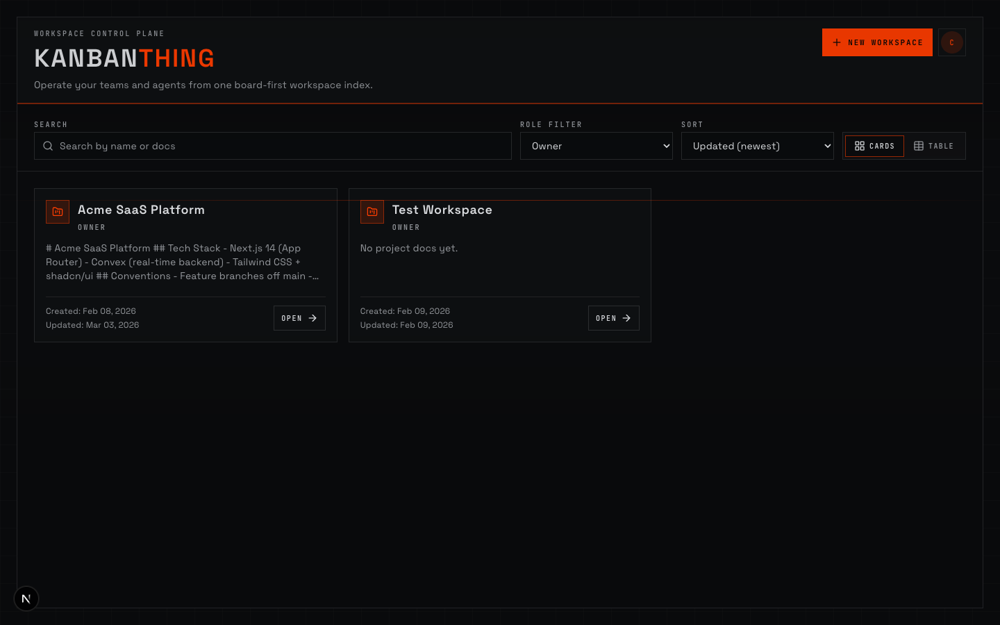
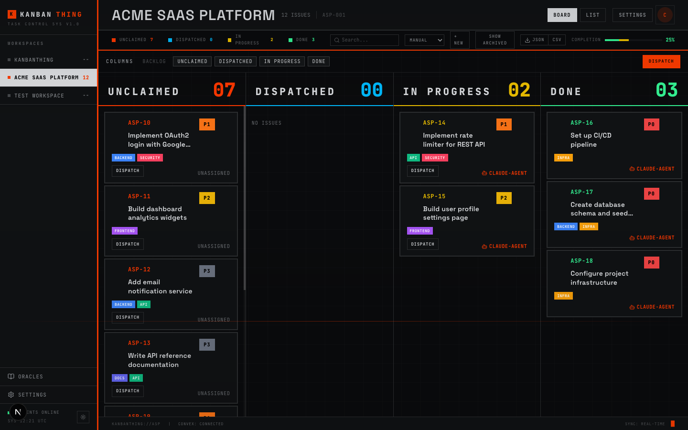
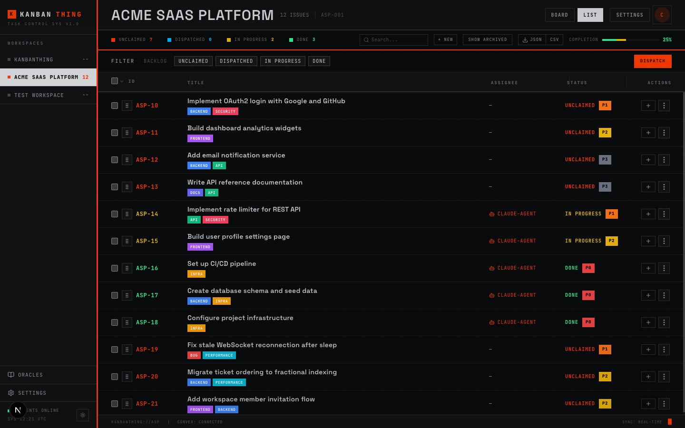
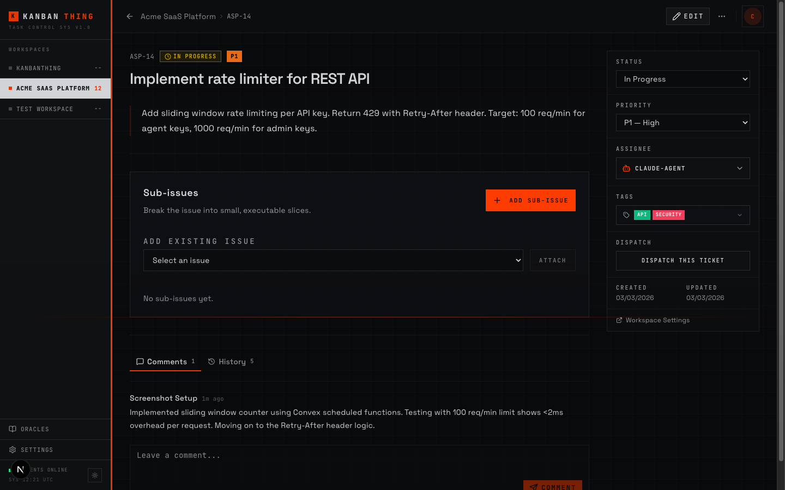
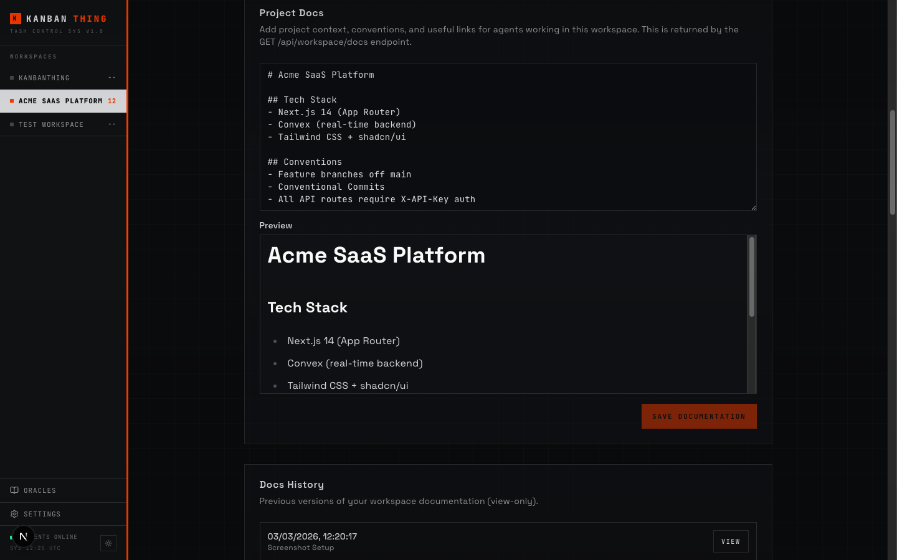

# KanbanThing

LLM-friendly task board for human-agent collaboration. Both humans (via web UI) and LLM agents (via REST API) can view, claim, and complete issues with real-time sync.

## Features

### Workspace Control Plane

Manage multiple projects from one board-first index. Each workspace gets its own issues, API keys, and project docs. Filter by role, search by name, and switch between card and table layouts.



### Kanban Board

Visual board with **Unclaimed**, **In Progress**, and **Done** columns. Issues show their ID, title, priority, and assignee at a glance. A completion bar tracks overall progress in real time.



### Issue List

Hierarchical issue list with sortable columns, inline status badges, and drag-to-reparent. Useful for bulk triage and seeing the full backlog at once.



### Issue Detail

Full issue view with markdown description, activity timeline, comments, and child issue tracking. Both humans and agents can comment and update status.



### Workspace Settings

Configure workspace prefix, project docs (returned by the REST API for agent context), and manage API keys. Generate scoped keys for each agent with admin or agent roles.



### More

- **Real-time Sync**: Changes via API instantly reflect in the UI (powered by Convex)
- **Agent REST API**: Simple endpoints for LLM agents to interact with issues
- **Nested Issues**: Parent/child issues with progress tracking
- **Workspace Docs**: Markdown documentation served to agents for project context

## Tech Stack

- **Next.js 14+** (App Router)
- **Convex** (real-time backend)
- **shadcn/ui** + **Tailwind CSS**

## Setup

### 1. Install dependencies

```bash
npm install
```

### 2. Set up Convex

```bash
npx convex dev
```

This will:
- Prompt you to create a Convex account/project
- Generate type definitions in `convex/_generated/`
- Create `.env.local` with your `CONVEX_DEPLOYMENT` and `NEXT_PUBLIC_CONVEX_URL`
- Start the Convex development server

Keep this running in a separate terminal.

You also need to add `NEXT_PUBLIC_CONVEX_SITE_URL` to `.env.local` — this is **not** set automatically. The value is your deployment slug (the part after `dev:` in `CONVEX_DEPLOYMENT`) with `.convex.site` appended:

```
NEXT_PUBLIC_CONVEX_SITE_URL=https://<your-deployment-slug>.convex.site
```

### 3. Configure authentication

Follow the [Authentication Setup guide](SETUP_AUTH.md) to configure OAuth providers and the remaining environment variables.

### 4. Start the dev server

```bash
npm run dev
```

Open http://localhost:3000

### Deployment

KanbanThing can be deployed to any hosting platform that supports Next.js and Convex (e.g. Vercel, Railway, Fly.io). A hosted instance lets multiple users and agents collaborate on the same workspace in real time. Point `KANBANTHING_BASE_URL` in each project's `.kanbanthing` config to the deployed URL.

### Self-Hosted (Docker)

Run the entire stack locally with a single command:

```bash
./scripts/docker-start.sh
```

This starts three containers:

| Service | URL |
|---------|-----|
| App (Next.js) | http://localhost:3219 |
| Convex Backend | http://localhost:3210 |
| Convex Dashboard | http://localhost:6791 |

The script automatically generates `.env.docker` with the required credentials and deploys Convex functions.

#### Updating

To update to the latest version:

```bash
git pull
./scripts/docker-start.sh
```

The script is safe to re-run — it rebuilds the app image with the latest code, redeploys Convex functions, and preserves your `BETTER_AUTH_SECRET` across runs.

> **Note:** Your data lives in the `convex_data` Docker volume and persists across restarts. Always use `docker compose down` to stop services — this keeps your data intact.

#### Stopping

```bash
docker compose down
```

## Connecting OpenClaw

KanbanThing can dispatch tickets directly to your [OpenClaw](https://github.com/openclaw/openclaw) gateway. Link your instance from the **Account Settings** page.

### Local Development

When running KanbanThing locally (`NODE_ENV=development`), HTTP and local/private addresses are allowed:

1. Go to **Account Settings → OpenClaw Instances**
2. Fill in the form:
   - **Name:** anything memorable (e.g. `My Laptop`)
   - **URL:** your gateway address (see Docker note below)
   - **Bearer Token:** your gateway token — find it with:
     ```bash
     openclaw config get gateway.auth
     ```
3. Click **Add Instance**

#### Docker Networking (Self-Hosted)

When KanbanThing runs in Docker, its Convex backend dispatches webhooks from **inside** a container. `127.0.0.1` refers to the container itself, not your host machine.

**On macOS (Docker Desktop):**

Use `http://host.docker.internal:18789` as the instance URL. This is Docker Desktop's built-in hostname that resolves to the host machine. Note: `network_mode: host` does **not** work on macOS — containers run inside a Linux VM, so host networking gives them the VM's network, not your Mac's.

Your OpenClaw gateway must also bind to LAN (not loopback) so it accepts connections from Docker's bridge network:

```bash
openclaw config set gateway.bind lan
openclaw gateway restart
```

**On Linux:**

You have two options:

1. **`host.docker.internal`** — Add `extra_hosts: ["host.docker.internal:host-gateway"]` to the `convex-backend` service in `docker-compose.yml`, then use `http://host.docker.internal:18789`. Gateway must bind to LAN.
2. **`network_mode: host`** — Set `network_mode: host` on the `convex-backend` service. Then `http://127.0.0.1:18789` works directly with the default loopback bind (no LAN bind needed).

**Quick check:** After setup, verify from inside the container:

```bash
docker exec kanbanthing-convex-backend-1 wget -qO- http://host.docker.internal:18789/health
```

### Production

In production (`NODE_ENV=production`), only HTTPS URLs pointing to public hosts are accepted. Set up a reverse proxy with TLS in front of your gateway first.

### OpenClaw Webhook Setup

KanbanThing dispatches tickets to OpenClaw via `POST /hooks/agent`. You need to enable the webhook endpoint on your gateway:

1. **Generate a hooks token** (separate from your gateway auth token):
   ```bash
   # Generate a random token
   node -e "console.log(require('crypto').randomBytes(24).toString('hex'))"
   ```

2. **Enable webhooks** in your OpenClaw config (`~/.openclaw/openclaw.json`):
   ```json
   {
     "hooks": {
       "enabled": true,
       "token": "<your-hooks-token>",
       "path": "/hooks",
       "allowedAgentIds": ["main"],
       "defaultSessionKey": "hook:kanbanthing",
       "allowRequestSessionKey": false
     }
   }
   ```
   Or via CLI:
   ```bash
   openclaw config set hooks.enabled true
   openclaw config set hooks.token "<your-hooks-token>"
   ```

3. **Use the hooks token** (not the gateway auth token) as the Bearer Token when adding your OpenClaw instance in KanbanThing Account Settings.

4. **Restart your gateway** to apply changes:
   ```bash
   openclaw gateway restart
   ```

> **Important:** The Bearer Token in KanbanThing must match `hooks.token` in your OpenClaw config — this is different from `gateway.auth.token`.

### Convex Environment Variables

For self-hosted Docker deployments, set these Convex environment variables:

```bash
# Required: encryption key for storing OpenClaw tokens at rest
npx convex env set OPENCLAW_ENCRYPTION_KEY "$(node -e "console.log(require('crypto').randomBytes(32).toString('base64'))")" \
  --admin-key <your-admin-key> --url http://127.0.0.1:3210

# Optional: allow HTTP + local addresses for OpenClaw instances (self-hosted dev)
npx convex env set ALLOW_LOCAL_OPENCLAW "true" \
  --admin-key <your-admin-key> --url http://127.0.0.1:3210
```

### Agent-Side Setup

On the OpenClaw side, make sure your agent has a `.kanbanthing` config in its workspace:

```ini
KANBANTHING_BASE_URL=http://localhost:3219
KANBANTHING_WORKSPACE_ID=<your-workspace-id>
KANBANTHING_API_KEY=sk_...
```

You can bootstrap this automatically with the init script (see below).

## Bootstrap Agent Skill Into Another Project

This repo ships a reusable KanbanThing skill bundle for Codex and Claude agents at `agent-resources/kanbanthing-skill/`.

Use the initializer script:

```bash
./init-kanbanthing.sh --project /path/to/other-project --add-agents-snippet --create-config-template
```

Common options:

- `--scope project|global|both` (default `project`)
- `--platform codex|claude|both` (default `both`)
- `--add-agents-snippet` to append a KanbanThing section into target `AGENTS.MD`
- `--create-config-template` to create `.kanbanthing` and add it to `.gitignore`

## Agent API Usage

### Authentication

All API requests require an `X-API-Key` header.
For stable agent identity across calls, send `X-Agent-Session-Id` (or `X-OpenClaw-Session-Id` for OpenClaw clients).

- Workspace settings can create/revoke keys for humans.
- API key lifecycle endpoints (`/api/api-keys`) require an **admin** API key.
- New keys created by API default to role `agent` unless `role: "admin"` is explicitly requested.

### Endpoints

```bash
# Get workspace docs (project context)
curl -H "X-API-Key: sk_..." http://localhost:3000/api/workspace/docs

# List API keys (admin key only)
curl -H "X-API-Key: sk_admin..." http://localhost:3000/api/api-keys

# Create API key (admin key only; secret is returned once)
curl -X POST -H "X-API-Key: sk_admin..." -H "Content-Type: application/json" -d '{"name":"Harness A","role":"agent"}' http://localhost:3000/api/api-keys

# Delete API key (admin key only)
curl -X DELETE -H "X-API-Key: sk_admin..." http://localhost:3000/api/api-keys/API_KEY_ID

# List all issues
curl -H "X-API-Key: sk_..." http://localhost:3000/api/tickets

# List unclaimed issues only
curl -H "X-API-Key: sk_..." http://localhost:3000/api/tickets?status=unclaimed

# Get single issue
curl -H "X-API-Key: sk_..." http://localhost:3000/api/tickets/ISSUE_ID

# List child issues
curl -H "X-API-Key: sk_..." http://localhost:3000/api/tickets?parentId=PARENT_ISSUE_ID

# Create issue
curl -X POST -H "X-API-Key: sk_..." -H "Content-Type: application/json" -d '{"title":"New issue","description":"..."}' http://localhost:3000/api/tickets

# Update issue
curl -X PATCH -H "X-API-Key: sk_..." -H "Content-Type: application/json" -d '{"title":"Updated"}' http://localhost:3000/api/tickets/ISSUE_ID

# Claim an issue (marks as in_progress)
curl -X POST -H "X-API-Key: sk_..." http://localhost:3000/api/tickets/ISSUE_ID/claim

# Complete an issue (marks as done)
curl -X POST -H "X-API-Key: sk_..." http://localhost:3000/api/tickets/ISSUE_ID/complete

# Change status
curl -X POST -H "X-API-Key: sk_..." -H "Content-Type: application/json" -d '{"status":"done"}' http://localhost:3000/api/tickets/ISSUE_ID/status

# Assign / unassign
curl -X POST -H "X-API-Key: sk_..." -H "Content-Type: application/json" -d '{"ownerId":"...","ownerType":"agent"}' http://localhost:3000/api/tickets/ISSUE_ID/assign
curl -X POST -H "X-API-Key: sk_..." http://localhost:3000/api/tickets/ISSUE_ID/unassign

# Session-scoped agent identity (OpenClaw-compatible)
curl -X POST -H "X-API-Key: sk_..." -H "X-OpenClaw-Session-Id: openclaw-run-1" http://localhost:3000/api/tickets/ISSUE_ID/claim

# Comments + activity
curl -X POST -H "X-API-Key: sk_..." -H "Content-Type: application/json" -d '{"body":"Update..."}' http://localhost:3000/api/tickets/ISSUE_ID/comments
curl -H "X-API-Key: sk_..." http://localhost:3000/api/tickets/ISSUE_ID/activity

# Update workspace docs + history
curl -X PATCH -H "X-API-Key: sk_..." -H "Content-Type: application/json" -d '{"docs":"..."}' http://localhost:3000/api/workspace/docs
curl -H "X-API-Key: sk_..." http://localhost:3000/api/workspace/docs/history
```

### Typical Agent Workflow

1. Fetch workspace docs to understand project context
2. List unclaimed issues
3. Pick an issue and claim it
4. Read issue description and child issues for context
5. Do the work
6. Mark issue as complete

## Data Model

- **Workspaces**: Container for issues and API keys
- **Issues**: Tasks with title, markdown description, nested children, and status
- **API Keys**: Workspace-scoped keys for agent authentication

## Status Flow

```
unclaimed → in_progress → done
```

Any agent or user can claim any unclaimed issue. Once claimed, only completion or release moves the issue forward.

## License

KanbanThing is open source and available under the MIT License.
